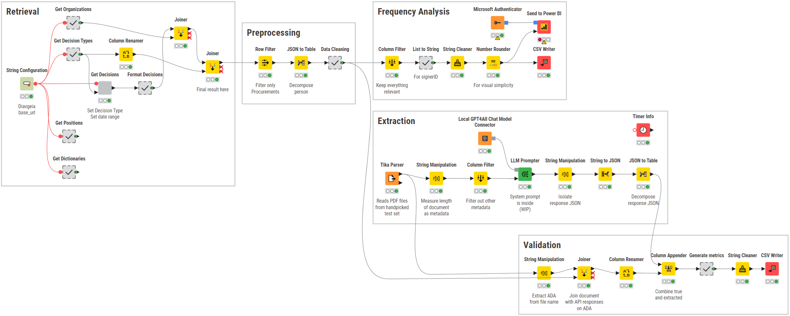

# Diavgeia Data Extraction and Analysis

## Overview
This project demonstrates the extraction, cleaning, and analysis of Greek government procurement documents (Diavgeia portal). The goal was to extract structured data from unstructured PDFs, handle missing data, validate the results with Local LLMs, and perform frequency analysis.

## Project Context
This work was conducted as a collaborative team effort within the framework of the Master’s program in Data Science at the International Hellenic University.

## Contents
- KNIME workflow for data extraction, processing, and LLM validation.
- Power BI report for data visualization and insights
- Documentation including final report and presentation slides
- Test data used and output csv's

## Usage Instructions
To be added.

## Key Results
- LLM-based validation on a sample of 30 documents showed promising extraction accuracy.
- Identification of major challenges and future research directions.

## Future Work
- Scaling up with cloud-based LLM APIs.
- Human-in-the-loop approaches for improved data quality.
- Potential to build domain-specific LLMs for Greek government documents.
