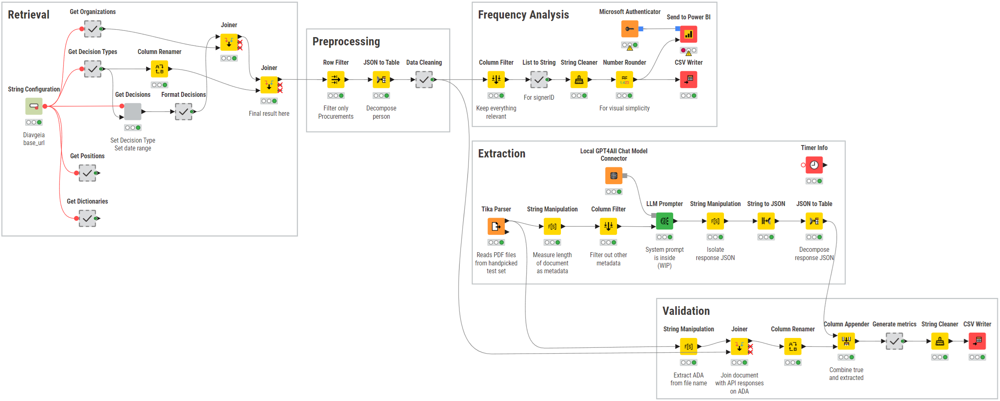

# Diavgeia Data Extraction and Analysis

This project demonstrates the extraction, cleaning and analysis of Greek government procurement documents taken from the public Diavgeia portal. The goal was to extract structured data from unstructured PDFs, handle missing data using Large Language Models, validate the results and perform frequency analysis.

## The Problem

The Greek Government created the Diavgeia Platform to promote transparency and provide free public access to governmental information.
It contains millions of government documents with valuable data about about public spending, procurements, administrative activity and more.
These documents are written in natural language, include scanned or poorly formatted content and often lack consistent structure.
These characteristics, coupled with the absence of strategy and analytical tools, has turned the platform into a document graveyard.

This project tackles the challenge of extracting and analyzing data from the Diavgeia portal.
The main challenge is to transform these messy documents into structured, analyzable datasets.

## The Dataset

340,000 documents were retrieved using the Diavgeia API. They were procurement documents from the entirely of the year 2024. API calls returned tuples containing a ULR to the document itself, along with many features structured in a relational way, entered into the system by clerks. From those, 170,000 were kept as part of our use case. An extremely significant 58% of this set contained missing or invalid data, rendering it unusable for analysis.

## Methodology

**Use Case & Scope Refinement:**
Focus was narrowed to procurement documents from the Diavgeia API, for the whole year 2024. These records contain both structured metadata and links to the original unstructured PDF documents.

Out of 340,000 retrieved entries, we filtered down to 170,000 procurement documents for our use case: analyzing supplier frequency to detect disproportionately frequent contractors. However, early exploration revealed a major roadblock: nearly 58% of entries had missing or invalid key data, including TINs and supplier names.

**Cleaning & Preprocessing:**
- Standardized inconsistent name and subject entries (e.g., lowercase/uppercase mismatches).
- Removed duplicate or conflicting entries by selecting the most frequent supplier name per TIN.
- Dropped entries with missing or unverifiable TINs or names, despite attempts to salvage them through other metadata.

This phase involved a mix of KNIME workflows and Power BI preprocessing tools.

**Frequency Analysis:**
With a cleaned dataset in hand, one can compute how frequently each supplier (by TIN) appeared. Z-scores were used to flag statistical outliers. Visualized the results in Power BI.

Despite surface-level insights, doubts remained. The volume of removed or missing data renders the reliability of any findings questionable: major players might be overlooked just because their records were malformed.

**LLM-based Information Extraction:**
In response, a bold idea: could Large Language Models help recover the missing data? To test this, a controlled experiment was created:
- Select 30 hand-picked procurement PDFs with verified TINs and supplier names.
- Test different LLMs to extract those values directly from the raw document text.
- Compare results against ground truth to evaluate extraction accuracy.

This step marked a shift from traditional data cleaning to AI-assisted imputation.

## Results and Key Takeaways

- LLMs show promise: Local models showed up to 50% accuracy in extracting TINs, despite limited compute.
- Major failure reasons: Most errors were due to context window limits, not actual language understanding.
- Frequency analysis revealed outliers: Just 50 suppliers won 7,000+ contracts, while the majority of ~15,000 suppliers won only 1–3 each.
- Data quality was a blocker: Incomplete, unreliable fields (especially TINs and monetary values) prevented substantial analyses.
- Preprocessing never ends: Data issues kept emerging during the pipeline; iterative cleaning was necessary.
- Human verification is indispensable: LLMs can hallucinate confidently. Even with automation, expert overview is required for trust.

## Future Work

- Scale up with cloud infrastructure: Migrate to cloud-based LLM APIs to upscale the experiment by processing thousands of documents in parallel.
- Beyond frequency analysis: Apply this pipeline to trend detection, anomaly spotting, and eventually predictive procurement modeling.

My ultimate, very ambitious goal is to train a domain-specific LLM, specialized in Greek public sector language and structure, tuned on Diavgeia documents.

## Repository Contents

- KNIME-workflow.knwf: Full pipeline for both frequency analysis and LLM validation.
- powerBI/: Power BI dashboards and visualizations used for frequency analysis and LLM performance.
- outputs/: Final output CSVs from the KNIME pipeline regarding LLM runs.
- Report.pdf: A written report detailing the methodology and results.

## Project Context
This work was conducted as a collaborative team effort as the coursework of the Data Science for Business class of the MSc in Data Science programme at the International Hellenic University.
